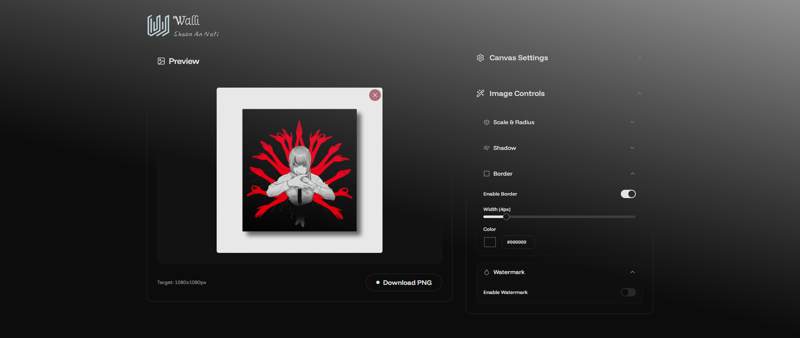

# Walli-Image_Tool

<div align="center">
  
</div>
<br/>
<div align="left">
  <!-- Add relevant badges here - e.g., License, Version, Build Status -->
  
  <!--  -->
  <!--  -->
</div>
<br/>

**Walli** is a modern React application designed to easily add custom backgrounds, shadows, borders, and watermarks to your images. Built with Vite, React, Tailwind CSS, and shadcn/ui, it offers a user-friendly interface with real-time previews, making image polishing a breeze.

Perfect for social media posts, presentations, or anywhere you need a clean, enhanced image with a consistent background or branding.

---

## ✨ Features

*   🖼️ **Image Upload:** Easily upload images from your device.
*   🎨 **Canvas Customization:**
    *   Set exact canvas dimensions (width & height).
    *   Choose from popular dimension presets (Instagram, Facebook, YouTube, etc.).
    *   Select custom background colors using a color picker or hex input.
    *   Quickly apply common aspect ratios (1:1, 16:9, 4:3, etc.).
*   🔧 **Image Adjustments (Real-time Preview):**
    *   **Scale:** Zoom in or out of the uploaded image [under development].
    *   **Corner Radius:** Add rounded corners to the image.
    *   **Shadow:** Apply customizable drop shadows (offset X/Y, blur, opacity).
    *   **Border:** Add a border with adjustable width and color.
    *   **Watermark:**
        *   Add custom text watermark.
        *   Control opacity, size (relative to image), color, and font family.
        *   Adjust horizontal position (left, center, right).
*   ✨ **Interactive Background:** Features a dynamic "Meteors" background effect using Magic UI.
*   ⬇️ **Download:** Export the final composed image as a high-quality PNG file.
*   📱 **Responsive Design:** Works across different screen sizes (layout adjusts for smaller screens).

---

## 🚀 Demo / Screenshot

*(It's highly recommended to add a GIF or screenshot demonstrating Walli in action!)*


<!--
**OR**

-->

---

## 🛠️ Tech Stack

*   **Framework:** [React](https://reactjs.org/)
*   **Build Tool:** [Vite](https://vitejs.dev/)
*   **Styling:** [Tailwind CSS](https://tailwindcss.com/)
*   **UI Components:** [shadcn/ui](https://ui.shadcn.com/) (uses Radix UI primitives)
*   **Icons:** [Lucide React](https://lucide.dev/)
*   **Form Management:** [React Hook Form](https://react-hook-form.com/)
*   **Language:** JavaScript (with JSX)

---

## ⚙️ Getting Started

Follow these steps to get a local copy up and running.

### Prerequisites

*   [Node.js](https://nodejs.org/) (v18 or later recommended)
*   [npm](https://www.npmjs.com/), [yarn](https://yarnpkg.com/), or [pnpm](https://pnpm.io/)

### Installation

1.  **Clone the repository:**
    ```bash
    git clone https://github.com/Nafisarkar/Walli-Image_Tool
    ```

2.  **Navigate to the project directory:**
    ```bash
    cd Walli-Image_Tool
    ```

3.  **Install dependencies:**
    ```bash
    npm install
    # or
    yarn install
    # or
    pnpm install
    ```

4.  **Run the development server:**
    ```bash
    npm run dev
    # or
    yarn dev
    # or
    pnpm dev
    ```

5.  Open your browser and navigate to `http://localhost:5173` (or the port specified by Vite).

---

## 📋 Usage

1.  **Upload Image:** Click the "Upload Image" button or the placeholder area in the preview section to select an image file from your computer.
2.  **Adjust Canvas:**
    *   Use the "Canvas Settings" accordion.
    *   Select a preset size or enter custom Width/Height values.
    *   Choose a background color using the color picker or by entering a hex code.
    *   Use the aspect ratio buttons for quick adjustments (based on current width).
3.  **Adjust Image:**
    *   Once an image is uploaded, the "Image Controls" accordion becomes available.
    *   Expand the nested sections (Scale & Radius, Shadow, Border, Watermark) to access controls.
    *   Use sliders and inputs to modify image scale, corner radius, shadow properties, border settings, and watermark details.
    *   Changes are reflected in the real-time preview panel.
4.  **Download:** Click the "Download PNG" button in the preview section to save your final image.

---

## 🤝 Contributing

Contributions are welcome! If you have suggestions for improvements or find a bug, please feel free to:

1.  Open an issue to discuss the change or report the bug.
2.  Fork the repository and create a pull request with your contribution.

Please ensure your code follows the existing style and includes relevant updates if necessary.

---

## 📄 License

This project is licensed under the MIT License - see the [LICENSE](LICENSE) file for details.

*(**Important:** Create a file named `LICENSE` in the root of your project and paste the contents of the MIT license into it. You can find the MIT license text easily online.)*

---

## ✨ Acknowledgements

*   [shadcn/ui](https://ui.shadcn.com/) for the excellent UI components.
*   [Magic UI](https://magicui.design/) for the cool background effects.
*   [Lucide React](https://lucide.dev/) for the clean icon set.

---

## 👤 Author

*   **Shaon An Nafi**
    *   Website: [shaonannafi.me](https://www.shaonannafi.me/)
    *   GitHub: [@Nafisarkar](https://github.com/Nafisarkar) 